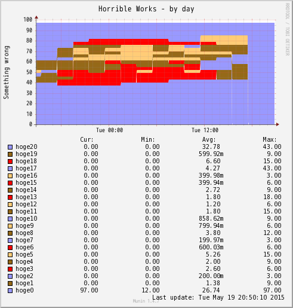
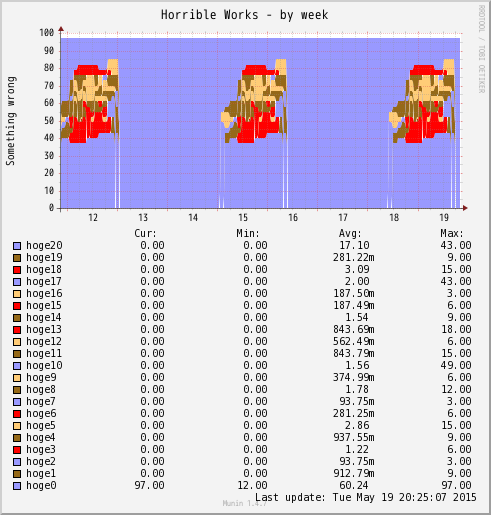

# munin-play

Play with Munin plug-in

## Examples:

## Requirements:

php 5.3.x or higher
munin and munin-node 

## Install:

- Copy the file into munin/plugins.
- Do chmod +x _file_
- Restart munin-node service
